# Center Last Row of Grid in a Responsive Manner

## Notes:

1. The `span` solution works by creating the factorial of the number of "visible" columns and then spanning across those columns to achieve an aesthetically balanced presentation. As such, this approach is not recommended for situations requiring a large number of "visible" columns.
2. The `two grid` solution works by moving the last row of the main grid to an `overflow` grid if the last row of the main grid is not full and there is more than one row. Unlike the `span` solution this solution is scalable but it may have some accessability issues.
